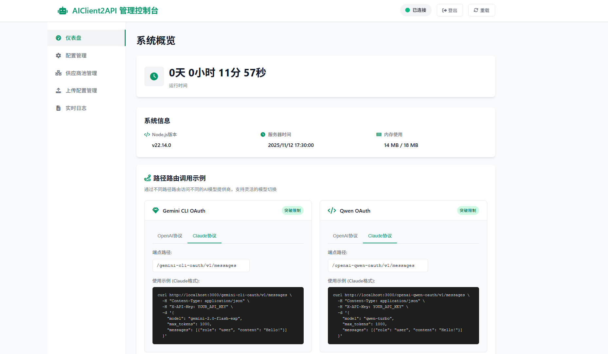

<div align="center">


# AIClient-2-API 🚀

**一个能将多种仅客户端内使用的大模型 API（Gemini CLI, Qwen Code Plus, Kiro Claude...），模拟请求，统一封装为本地 OpenAI 兼容接口的强大代理。**

</div>

<div align="center">

<a href="https://deepwiki.com/justlovemaki/AIClient-2-API"></a>

[](https://www.gnu.org/licenses/gpl-3.0)
[](https://nodejs.org/)
[](https://aiproxy.justlikemaki.vip/zh/docs/installation/docker-deployment.html)


[**中文**](./README-ZH.md) | [**English**](./README.md) | [**日本語**](./README-JA.md) | [**📚 完整文档**](https://aiproxy.justlikemaki.vip/zh/)

</div>

`AIClient2API` 是一个突破客户端限制的 API 代理服务，将 Gemini CLI、Qwen Code Plus、Kiro Claude 等原本仅限客户端使用的免费大模型，转换为可供任何应用调用的标准 OpenAI 兼容接口。基于 Node.js 构建，支持 OpenAI、Claude、Gemini 三大协议的智能互转，让 Cherry-Studio、NextChat、Cline 等工具能够免费大量使用 Claude Sonnet 4.5、Gemini 2.5 Flash、Qwen3 Coder Plus 等高级模型。项目采用策略模式和适配器模式的模块化架构，内置账号池管理、智能轮询、自动故障转移和健康检查机制，确保 99.9% 的服务可用性。

> [!NOTE]
> **🎉 重要里程碑**
>
> - 感谢阮一峰老师在 [周刊 359 期](https://www.ruanyifeng.com/blog/2025/08/weekly-issue-359.html) 的推荐
>
> **📅 版本更新日志**
>
> - **2025.12.11** - Docker 镜像自动构建并发布到 Docker Hub: [justlikemaki/aiclient-2-api](https://hub.docker.com/r/justlikemaki/aiclient-2-api)
> - **2025.11.30** - 新增 Antigravity 协议支持，支持通过 Google 内部接口访问 Gemini 3 Pro、Claude Sonnet 4.5 等模型
> - **2025.11.16** - 新增 Ollama 协议支持，统一接口访问所有支持的模型（Claude、Gemini、Qwen、OpenAI等）
> - **2025.11.11** - 新增 Web UI 管理控制台，支持实时配置管理和健康状态监控
> - **2025.11.06** - 新增对 Gemini 3 预览版的支持，增强模型兼容性和性能优化
> - **2025.10.18** - Kiro 开放注册，新用户赠送 500 额度，已完整支持 Claude Sonnet 4.5
> - **2025.09.01** - 集成 Qwen Code CLI，新增 `qwen3-coder-plus` 模型支持
> - **2025.08.29** - 发布账号池管理功能，支持多账号轮询、智能故障转移和自动降级策略
>   - 配置方式：在 config.json 中添加 `PROVIDER_POOLS_FILE_PATH` 参数
>   - 参考配置：[provider_pools.json](./provider_pools.json.example)

---

## 💡 核心优势

### 🎯 统一接入，一站式管理
*   **多模型统一接口**：通过标准 OpenAI 兼容协议，一次配置即可接入 Gemini、Claude、GPT、Qwen Code、Kimi K2、GLM-4.6 等主流大模型
*   **灵活切换机制**：支持通过启动参数、Path 路由、环境变量三种方式动态切换模型，满足不同场景需求
*   **零成本迁移**：完全兼容 OpenAI API 规范，Cherry-Studio、NextChat、Cline 等工具无需修改即可使用
*   **多协议智能转换**：支持 OpenAI、Claude、Gemini 三大协议间的智能转换，实现跨协议模型调用
    *   使用 OpenAI 协议调用 Claude 模型：可使用 `claude-custom` 或 `claude-kiro-oauth` 提供商
    *   使用 OpenAI 协议调用 Gemini 模型：可使用 `gemini-cli-oauth` 提供商
    *   使用 Claude 协议调用 Gemini 模型：可使用 `gemini-cli-oauth` 提供商
    *   使用 Claude 协议调用 OpenAI 模型：可使用 `openai-custom` 或 `openai-qwen-oauth` 提供商

### 🚀 突破限制，提升效率
*   **绕过官方限制**：利用 OAuth 授权机制，有效突破 Gemini 等服务的免费 API 速率和配额限制
*   **免费高级模型**：通过 Kiro API 模式免费使用 Claude Sonnet 4.5，通过 Qwen OAuth 模式使用 Qwen3 Coder Plus，降低使用成本
*   **账号池智能调度**：支持多账号轮询、自动故障转移和配置降级，确保 99.9% 服务可用性

### 🛡️ 安全可控，数据透明
*   **全链路日志记录**：捕获所有请求和响应数据，支持审计、调试
*   **私有数据集构建**：基于日志数据快速构建专属训练数据集
*   **系统提示词管理**：支持覆盖和追加两种模式，实现统一基础指令与个性化扩展的完美结合

### 🔧 开发友好，易于扩展
*   **Web UI 管理控制台**：实时配置管理、健康状态监控、API 测试和日志查看
*   **模块化架构**：基于策略模式和适配器模式，新增模型提供商仅需 3 步
*   **完整测试保障**：集成测试和单元测试覆盖率 90%+，确保代码质量
*   **容器化部署**：提供 Docker 支持，一键部署，跨平台运行
*   **MCP 协议支持**：完美兼容 Model Context Protocol，轻松扩展功能

---

## 📑 快速导航

- [🐳 Docker 部署](https://aiproxy.justlikemaki.vip/zh/docs/installation/docker-deployment.html)
- [🎨 模型协议与提供商关系图](#-模型协议与提供商关系图)
- [🔧 使用说明](#-使用说明)
- [🚀 项目启动参数](#-项目启动参数)
- [📄 开源许可](#-开源许可)
- [🙏 致谢](#-致谢)
- [⚠️ 免责声明](#-免责声明)

---

## 🎨 模型协议与提供商关系图

本项目通过不同的协议（Protocol）支持多种模型提供商（Model Provider）。以下是它们之间的关系概述：

*   **OpenAI 协议 (P_OPENAI)**：由 `openai-custom`, `gemini-cli-oauth`, `claude-custom`, `claude-kiro-oauth` 和 `openai-qwen-oauth` 等模型提供商实现。
*   **Claude 协议 (P_CLAUDE)**：由 `claude-custom`, `claude-kiro-oauth`, `gemini-cli-oauth`, `openai-custom` 和 `openai-qwen-oauth` 等模型提供商实现。
*   **Gemini 协议 (P_GEMINI)**：由 `gemini-cli-oauth` 模型提供商实现。

详细关系图如下：


  ```mermaid
   
   graph TD
       subgraph Core_Protocols["核心协议"]
           P_OPENAI[OpenAI Protocol]
           P_GEMINI[Gemini Protocol]
           P_CLAUDE[Claude Protocol]
       end
   
       subgraph Supported_Model_Providers["支持的模型提供商"]
           MP_OPENAI[openai-custom]
           MP_GEMINI[gemini-cli-oauth]
           MP_CLAUDE_C[claude-custom]
           MP_CLAUDE_K[claude-kiro-oauth]
           MP_QWEN[openai-qwen-oauth]
           MP_OPENAI_RESP[openaiResponses-custom]
       end
   
       P_OPENAI ---|支持| MP_OPENAI
       P_OPENAI ---|支持| MP_QWEN
       P_OPENAI ---|支持| MP_GEMINI
       P_OPENAI ---|支持| MP_CLAUDE_C
       P_OPENAI ---|支持| MP_CLAUDE_K
       P_OPENAI ---|支持| MP_OPENAI_RESP
   
       P_GEMINI ---|支持| MP_GEMINI
   
       P_CLAUDE ---|支持| MP_CLAUDE_C
       P_CLAUDE ---|支持| MP_CLAUDE_K
       P_CLAUDE ---|支持| MP_GEMINI
       P_CLAUDE ---|支持| MP_OPENAI
       P_CLAUDE ---|支持| MP_QWEN
       P_CLAUDE ---|支持| MP_OPENAI_RESP
   
       style P_OPENAI fill:#f9f,stroke:#333,stroke-width:2px
       style P_GEMINI fill:#ccf,stroke:#333,stroke-width:2px
       style P_CLAUDE fill:#cfc,stroke:#333,stroke-width:2px

  ```

---

## 🔧 使用说明

### 🚀 install-and-run 脚本快速启动

使用 AIClient-2-API 最简单的方式是使用我们的自动化安装启动脚本。我们提供了 Linux/macOS 和 Windows 两个版本：

#### Linux/macOS 用户
```bash
# 给脚本添加执行权限并运行
chmod +x install-and-run.sh
./install-and-run.sh
```

#### Windows 用户
```cmd
# 运行批处理文件
install-and-run.bat
```

#### 脚本功能说明

`install-and-run` 脚本会自动执行以下操作：

1. **检查 Node.js 安装**：验证 Node.js 是否已安装，如缺失则提供下载链接
2. **依赖管理**：如果 `node_modules` 不存在，自动安装 npm 依赖包
3. **文件验证**：确保所有必需的项目文件都存在
4. **服务器启动**：在 `http://localhost:3000` 启动 API 服务器
5. **Web UI 访问**：直接提供管理控制台的访问地址

#### 脚本执行示例
```
========================================
  AI Client 2 API 快速安装启动脚本
========================================

[检查] 正在检查Node.js是否已安装...
✅ Node.js已安装，版本: v20.10.0
✅ 找到package.json文件
✅ node_modules目录已存在
✅ 项目文件检查完成

========================================
  启动AI Client 2 API服务器...
========================================

🌐 服务器将在 http://localhost:3000 启动
📖 访问 http://localhost:3000 查看管理界面
⏹️  按 Ctrl+C 停止服务器
```

> **💡 提示**：脚本会自动安装依赖并启动服务器。如果遇到任何问题，脚本会提供清晰的错误信息和解决建议。

---

### 📋 核心功能

#### Web UI 管理控制台



功能完善的 Web 管理界面，包含：

**📊 仪表盘**：系统概览、交互式路由示例、客户端配置指南

**⚙️ 配置管理**：实时参数修改，支持所有提供商（Gemini、OpenAI、Claude、Kiro、Qwen），包含高级设置和文件上传

**🔗 提供商池**：监控活动连接、提供商健康统计、启用/禁用管理

**📁 配置文件**：OAuth 凭据集中管理，支持搜索过滤和文件操作

**📜 实时日志**：系统日志和请求日志实时显示，带管理控制

**🔐 登录验证**：默认密码 `admin123`，可通过 `pwd` 文件修改

访问：`http://localhost:3000` → 登录 → 侧边栏导航 → 立即生效

#### MCP 协议支持
本项目完全兼容 **Model Context Protocol (MCP)**，可与支持 MCP 的客户端无缝集成，实现强大的功能扩展。

#### 多模态输入能力
支持图片、文档等多种类型的输入，为您提供更丰富的交互体验和更强大的应用场景。

#### 最新模型支持
无缝支持以下最新大模型，仅需在 [`config.json`](./config.json) 中配置相应的 OpenAI 或 Claude 兼容接口：
*   **Kimi K2** - 月之暗面最新旗舰模型
*   **GLM-4.5** - 智谱 AI 最新版本
*   **Qwen Code** - 阿里通义千问代码专用模型
*   **Gemini 3** - Google 最新预览版模型
*   **Claude Sonnet 4.5** - Anthropic 最新旗舰模型

---

### 🔐 授权配置指南

#### Gemini CLI OAuth 配置
1. **获取OAuth凭据**：访问 [Google Cloud Console](https://console.cloud.google.com/) 创建项目，启用Gemini API
2. **首次授权**：使用Gemini服务后，命令行会打印Google授权页面，复制页面到浏览器授权，完成后返回命令行
3. **凭据存储**：授权成功后，`oauth_creds.json` 文件将自动生成并保存至 `~/.gemini` 目录
4. **项目配置**：需要提供有效的Google Cloud项目ID，可通过启动参数 `--project-id` 指定

#### Qwen Code OAuth 配置
1. **首次授权**：启动服务后，系统会自动在浏览器中打开授权页面
2. **凭据存储**：授权成功后，`oauth_creds.json` 文件将自动生成并保存至 `~/.qwen` 目录
3. **推荐参数**：使用官方默认参数以获得最佳效果
   ```json
   {
     "temperature": 0,
     "top_p": 1
   }
   ```

#### Kiro API 配置
1. **环境准备**：[下载并安装 Kiro 客户端](https://aibook.ren/archives/kiro-install)
2. **完成授权**：在客户端中登录账号，生成 `kiro-auth-token.json` 凭据文件
3. **最佳实践**：推荐配合 **Claude Code** 使用，可获得最优体验
4. **重要提示**：Kiro 服务使用政策已更新，请访问官方网站查看最新使用限制和条款

#### 账号池管理配置
1. **创建号池配置文件**：参考 [provider_pools.json.example](./provider_pools.json.example) 创建配置文件
2. **配置号池参数**：在 config.json 中设置 `PROVIDER_POOLS_FILE_PATH` 指向号池配置文件
3. **启动参数配置**：使用 `--provider-pools-file <path>` 参数指定号池配置文件路径
4. **健康检查**：系统会定期自动执行健康检查，移除不健康的提供商

---

### 🔄 模型提供商切换

本项目提供两种灵活的模型切换方式，满足不同使用场景的需求。

通过在 API 请求路径中指定提供商标识，实现即时切换：

| 路由路径 | 说明 | 适用场景 |
|---------|------|---------|
| `/claude-custom` | 使用配置文件中的 Claude API | 官方 Claude API 调用 |
| `/claude-kiro-oauth` | 通过 Kiro OAuth 访问 Claude | 免费使用 Claude Sonnet 4.5 |
| `/openai-custom` | 使用 OpenAI 提供商处理请求 | 标准 OpenAI API 调用 |
| `/gemini-cli-oauth` | 通过 Gemini CLI OAuth 访问 | 突破 Gemini 免费限制 |
| `/openai-qwen-oauth` | 通过 Qwen OAuth 访问 | 使用 Qwen Code Plus |
| `/openaiResponses-custom` | OpenAI Responses API | 结构化对话场景 |
| `/ollama` | Ollama API 协议 | 统一访问所有支持的模型 |
 
**使用示例**：
```bash
# 在 Cline、Kilo 等编程 Agent 中配置
API_ENDPOINT=http://localhost:3000/claude-kiro-oauth

# 直接 API 调用
curl http://localhost:3000/gemini-cli-oauth/v1/chat/completions \
  -H "Content-Type: application/json" \
  -d '{"model":"gemini-2.0-flash-exp","messages":[...]}'
```

### 🦙 Ollama 协议使用示例

本项目支持 Ollama 协议，可以通过统一接口访问所有支持的模型。Ollama 端点提供 `/api/tags`、`/api/chat`、`/api/generate` 等标准接口。

**Ollama API 调用示例**：

1. **列出所有可用模型**：
```bash
curl http://localhost:3000/ollama/api/tags
```

2. **聊天接口**：
```bash
curl http://localhost:3000/ollama/api/chat \
  -H "Content-Type: application/json" \
  -d '{
    "model": "[Claude] claude-sonnet-4.5",
    "messages": [
      {"role": "user", "content": "你好"}
    ]
  }'
```

3. **使用模型前缀指定提供商**：
- `[Kiro]` - 使用 Kiro API 访问 Claude 模型
- `[Claude]` - 使用 Claude 官方 API
- `[Gemini CLI]` - 通过 Gemini CLI OAuth 访问
- `[OpenAI]` - 使用 OpenAI 官方 API
- `[Qwen CLI]` - 通过 Qwen OAuth 访问

---

### 📁 授权文件存储路径

各服务的授权凭据文件默认存储位置：

| 服务 | 默认路径 | 说明 |
|------|---------|------|
| **Gemini** | `~/.gemini/oauth_creds.json` | OAuth 认证凭据 |
| **Kiro** | `~/.aws/sso/cache/kiro-auth-token.json` | Kiro 认证令牌 |
| **Qwen** | `~/.qwen/oauth_creds.json` | Qwen OAuth 凭据 |
| **Antigravity** | `~/.antigravity/oauth_creds.json` | Antigravity OAuth 凭据 |

> **说明**：`~` 表示用户主目录（Windows: `C:\Users\用户名`，Linux/macOS: `/home/用户名` 或 `/Users/用户名`）
>
> **自定义路径**：可通过配置文件中的相关参数或环境变量指定自定义存储位置

---

## 🚀 项目启动参数

本项目支持丰富的命令行参数配置，可以根据需要灵活调整服务行为。以下是对所有启动参数的详细说明，按功能分组展示：

### 🔧 服务器配置参数

| 参数 | 类型 | 默认值 | 说明 |
|------|------|--------|------|
| `--host` | string | localhost | 服务器监听地址 |
| `--port` | number | 3000 | 服务器监听端口 |
| `--api-key` | string | 123456 | 用于 API 身份验证的密钥 |

### 🤖 模型提供商配置参数

| 参数 | 类型 | 默认值 | 说明 |
|------|------|--------|------|
| `--model-provider` | string | gemini-cli-oauth | AI 模型提供商，可选值：openai-custom, claude-custom, gemini-cli-oauth, claude-kiro-oauth, openai-qwen-oauth, openaiResponses-custom, gemini-antigravity |

### 🧠 OpenAI 兼容提供商参数

| 参数 | 类型 | 默认值 | 说明 |
|------|------|--------|------|
| `--openai-api-key` | string | null | OpenAI API 密钥 (当 `model-provider` 为 `openai-custom` 时必需) |
| `--openai-base-url` | string | null | OpenAI API 基础 URL (当 `model-provider` 为 `openai-custom` 时必需) |

### 🖥️ Claude 兼容提供商参数

| 参数 | 类型 | 默认值 | 说明 |
|------|------|--------|------|
| `--claude-api-key` | string | null | Claude API 密钥 (当 `model-provider` 为 `claude-custom` 时必需) |
| `--claude-base-url` | string | null | Claude API 基础 URL (当 `model-provider` 为 `claude-custom` 时必需) |

### 🔐 Gemini OAuth 认证参数

| 参数 | 类型 | 默认值 | 说明 |
|------|------|--------|------|
| `--gemini-oauth-creds-base64` | string | null | Gemini OAuth 凭据的 Base64 字符串 (当 `model-provider` 为 `gemini-cli-oauth` 时可选，与 `--gemini-oauth-creds-file` 二选一) |
| `--gemini-oauth-creds-file` | string | null | Gemini OAuth 凭据 JSON 文件路径 (当 `model-provider` 为 `gemini-cli-oauth` 时可选，与 `--gemini-oauth-creds-base64` 二选一) |
| `--project-id` | string | null | Google Cloud 项目 ID (当 `model-provider` 为 `gemini-cli-oauth` 时必需) |

### 🎮 Kiro OAuth 认证参数

| 参数 | 类型 | 默认值 | 说明 |
|------|------|--------|------|
| `--kiro-oauth-creds-base64` | string | null | Kiro OAuth 凭据的 Base64 字符串 (当 `model-provider` 为 `claude-kiro-oauth` 时可选，与 `--kiro-oauth-creds-file` 二选一) |
| `--kiro-oauth-creds-file` | string | null | Kiro OAuth 凭据 JSON 文件路径 (当 `model-provider` 为 `claude-kiro-oauth` 时可选，与 `--kiro-oauth-creds-base64` 二选一) |

### 🐼 Qwen OAuth 认证参数

| 参数 | 类型 | 默认值 | 说明 |
|------|------|--------|------|
| `--qwen-oauth-creds-file` | string | null | Qwen OAuth 凭据 JSON 文件路径 (当 `model-provider` 为 `openai-qwen-oauth` 时可选) |

### 🌌 Antigravity OAuth 认证参数

| 参数 | 类型 | 默认值 | 说明 |
|------|------|--------|------|
| `--antigravity-oauth-creds-file` | string | null | Antigravity OAuth 凭据 JSON 文件路径 (当 `model-provider` 为 `gemini-antigravity` 时可选) |

### 🔄 OpenAI Responses API 参数

| 参数 | 类型 | 默认值 | 说明 |
|------|------|--------|------|
| `--model-provider` | string | openaiResponses-custom | 模型提供商，使用OpenAI Responses API时设置为 `openaiResponses-custom` |
| `--openai-api-key` | string | null | OpenAI API 密钥 (当 `model-provider` 为 `openaiResponses-custom` 时必需) |
| `--openai-base-url` | string | null | OpenAI API 基础 URL (当 `model-provider` 为 `openaiResponses-custom` 时必需) |

### 📝 系统提示配置参数

| 参数 | 类型 | 默认值 | 说明 |
|------|------|--------|------|
| `--system-prompt-file` | string | input_system_prompt.txt | 系统提示文件路径 |
| `--system-prompt-mode` | string | overwrite | 系统提示模式，可选值：overwrite（覆盖）, append（追加） |

### 📊 日志配置参数

| 参数 | 类型 | 默认值 | 说明 |
|------|------|--------|------|
| `--log-prompts` | string | none | 提示日志模式，可选值：console（控制台）, file（文件）, none（无） |
| `--prompt-log-base-name` | string | prompt_log | 提示日志文件基础名称 |

### 🔄 重试机制参数

| 参数 | 类型 | 默认值 | 说明 |
|------|------|--------|------|
| `--request-max-retries` | number | 3 | API 请求失败时，自动重试的最大次数 |
| `--request-base-delay` | number | 1000 | 自动重试之间的基础延迟时间（毫秒），每次重试后延迟会增加 |

### ⏰ 定时任务参数

| 参数 | 类型 | 默认值 | 说明 |
|------|------|--------|------|
| `--cron-near-minutes` | number | 15 | OAuth 令牌刷新任务计划的间隔时间（分钟） |
| `--cron-refresh-token` | boolean | true | 是否开启 OAuth 令牌自动刷新任务 |

### 🎯 号池配置参数

| 参数 | 类型 | 默认值 | 说明 |
|------|------|--------|------|
| `--provider-pools-file` | string | null | 提供商号池配置文件路径 |

### 使用示例

```bash
# 基本用法
node src/api-server.js

# 指定端口和API密钥
node src/api-server.js --port 8080 --api-key my-secret-key

# 使用OpenAI提供商
node src/api-server.js --model-provider openai-custom --openai-api-key sk-xxx --openai-base-url https://api.openai.com/v1

# 使用Claude提供商
node src/api-server.js --model-provider claude-custom --claude-api-key sk-ant-xxx --claude-base-url https://api.anthropic.com

# 使用OpenAI Responses API提供商
node src/api-server.js --model-provider openaiResponses-custom --openai-api-key sk-xxx --openai-base-url https://api.openai.com/v1

# 使用Gemini提供商（Base64凭据）
node src/api-server.js --model-provider gemini-cli-oauth --gemini-oauth-creds-base64 eyJ0eXBlIjoi... --project-id your-project-id

# 使用Gemini提供商（凭据文件）
node src/api-server.js --model-provider gemini-cli-oauth --gemini-oauth-creds-file /path/to/credentials.json --project-id your-project-id

# 配置系统提示
node src/api-server.js --system-prompt-file custom-prompt.txt --system-prompt-mode append

# 配置日志
node src/api-server.js --log-prompts console
node src/api-server.js --log-prompts file --prompt-log-base-name my-logs

# 配置号池
node src/api-server.js --provider-pools-file ./provider_pools.json

# 完整示例
node src/api-server.js \
  --host 0.0.0.0 \
  --port 3000 \
  --api-key my-secret-key \
  --model-provider gemini-cli-oauth \
  --project-id my-gcp-project \
  --gemini-oauth-creds-file ./credentials.json \
  --system-prompt-file ./custom-system-prompt.txt \
  --system-prompt-mode overwrite \
  --log-prompts file \
  --prompt-log-base-name api-logs \
  --provider-pools-file ./provider_pools.json
```

---

## 📄 开源许可

本项目遵循 [**GNU General Public License v3 (GPLv3)**](https://www.gnu.org/licenses/gpl-3.0) 开源许可。详情请查看根目录下的 `LICENSE` 文件。
## 🙏 致谢

本项目的开发受到了官方 Google Gemini CLI 的极大启发，并参考了Cline 3.18.0 版本 `gemini-cli.ts` 的部分代码实现。在此对 Google 官方团队和 Cline 开发团队的卓越工作表示衷心的感谢！
### 贡献者列表

感谢以下所有为 AIClient-2-API 项目做出贡献的开发者：

[](https://github.com/justlovemaki/AIClient-2-API/graphs/contributors)


## 🌟 Star History


[](https://www.star-history.com/#justlovemaki/AIClient-2-API&Timeline)

---

## ⚠️ 免责声明

### 使用风险提示
本项目（AIClient-2-API）仅供学习和研究使用。用户在使用本项目时，应自行承担所有风险。作者不对因使用本项目而导致的任何直接、间接或 consequential 损失承担责任。

### 第三方服务责任说明
本项目是一个API代理工具，不提供任何AI模型服务。所有AI模型服务由相应的第三方提供商（如Google、OpenAI、Anthropic等）提供。用户在使用本项目访问这些第三方服务时，应遵守各第三方服务的使用条款和政策。作者不对第三方服务的可用性、质量、安全性或合法性承担责任。

### 数据隐私说明
本项目在本地运行，不会收集或上传用户的任何数据。但用户在使用本项目时，应注意保护自己的API密钥和其他敏感信息。建议用户定期检查和更新自己的API密钥，并避免在不安全的网络环境中使用本项目。

### 法律合规提醒
用户在使用本项目时，应遵守所在国家/地区的法律法规。严禁将本项目用于任何非法用途。如因用户违反法律法规而导致的任何后果，由用户自行承担全部责任。
